# javascript
1. [자바스크립트 사용방법](#자바스크립트-사용법)
   1. [인라인](#인라인)
   2. [내부](#내부)
   3. [외부](#외부)

2. [자바스크립트 자료형](#자바스크립트-자료형)
   1. [변수](#변수--variable-)
   2. [상수](#상수--constant-)
   3. [숫자형](#숫자) 
   4. [문자형](#문자)
   5. [참/거짓](#Boolean)
   6. [객체형](#객체형--object-)
   7. [자료형 파악하기](#변수의-자료형)
   8. [자료형 변환하기](#자료형-변환)

3. [자바스크립트 연산자](#자바스크립트-연산자)
   1. [할당연산자](#할당연산자)
   2. [산술연산자](#산술-연산자)
   3. [복합 할당연산자](#복합-할당연산자)
   4. [비교연산자](#비교연산자)
   5. [삼항연산자](#삼항연산자)
   6. [논리연산자](#논리연산자)

4. [자바스크립트 제어문](#자바스크립트-제어문)

# 자바스크립트 사용법
## 개요
### 인라인

- 특정 html요소에 따른 이벤트 속성으로 자바스크립트 코드가 언제 실행할지를 지정함

```html
<button type="button" onclick="alert('헬로월드')">hello maker</button>
```

### 내부

head나 body에 script라는 태그 안에 실행할 자바스크립트 코드를 작성함
그런데, head안에 스크립트를 작성히 브라우저가 body의 html코드를 읽기전에 스크립트 실행

```html
<!DOCTYPE html>
<html lang="ko">
  <head>
    <script>
      console.log("helo world!!");
    </script>
  </head>

  <body></body>
</html>
```

반면, body안에서 실행하면 브라우저 화면이 다 뜬채로 스크립트가 실행되므로 페이지 로딩속도가 빨라짐

```html
<!DOCTYPE html>
<html lang="ko">
  <head> </head>
  <body>
    <script>
      console.log("helo world!!");
    </script>
  </body>
</html>
```

### 외부

자바스크립트 코드가 포함된 파일을 작성하고 이것을 head 혹은 body에 참조하도록 하는 방식

```html
<!DOCTYPE html>
<html lang="ko">
  <head> </head>
  <body>
    <script src="./js/hello.js"></script>
  </body>
</html>
```

./js/hello.js

```javascript
console.log("helo world!!");
```


# 자바스크립트 자료형
## 변수와 상수
### 변수(variable)
*   데이터를 담는 그릇
```javascript
    var 변수명 = 초기값;
    let 변수명 = 초기값;
```
* 차이점 (선언에 따른 차이: 오류 발생 vs 발생하지 않음)
```javascript
      var z;
      let a;
      
      document.write(`var z 의 값은 ${z} <br>`);
      document.write(`let a 의 값은 ${a} <br>`);
      
      var z =10;
      let a =10;
      document.write(`var z 의 값은 ${z} <br>`);
      document.write(`let a 의 값은 ${a} <br>`);

```
let a의 경우 하단과 같은 오류 발생<br>
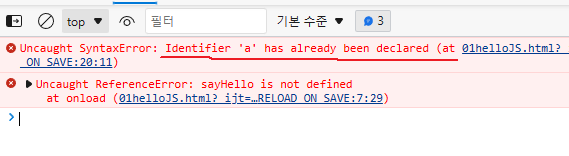

>변수 선언시 var이나 let(ES6에서 추가)을 사용
실무에서는 오류를 최소화하기 위해 let사용을 추천!
자바스크립트에서는 각 문장의 끝은 ;으로 마무리해야 함

>변수에 내용 없이 실행하면 undifiend가 출력됨.
```javascript
   var z;
   let a;
   document.write(`var z 의 값은 ${z} <br>`);
   document.write(`let a 의 값은 ${a} <br>`);
```
>결과 <br>
>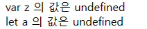

### 상수(constant)
* 변하지 않는 값을 담는 그릇
```javascript
    const 상수명 = 값;
```

### 예시 
```javascript
    let n = prompt('값을 입력해주세요!',0);
    let 원주율 = 0;
    const pi = 3.14;
    
    function pI(n,pi){
        원주율 =  pi * n * n;
    }

```

## 숫자 
### Numnber
* 정수, 실수등을 다룰 수 있음
* 일반적인 숫자 외에 추가적으로 NaN(not a number), infinity/-infinity 등의 특수 수자값 사용가능 
```javascript
   let o=1;
   document.write(`y / 0 =${ o / 0}<br>`);
   let k ='hello';
   document.write(`y * k =${ o * k}<br>`);
```
> 결과<br>
> 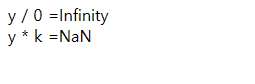
 


### Bigint
* 기존 정수보다 더 많은범위를 다룰 수 있음

```javascript
   let j = 12132245646545646548787987445645645645456465464646546464654555555555555555555555546545646546546464;
   document.write(`완전 큰 숫자${j}<br>`);
   
   j= BigInt(1213224564654564654878798744564564564545646546464654646465455555555555555555555554654564654654646412132245646545646548787987445645645645456465464646546464654555555555555555555555546545646546546464)
   document.write(`완전 큰 숫자${j}<br>`);
```
> 결과 <br>
> 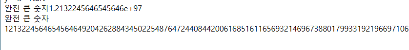
** 추가 내용: Bigint안의 숫자는 '문자'형으로 들어가야함 : 전체가 안보임

* Bigint는 아래와 같이 숫자 끝에 n을 붙여도 됨.
```javascript
j=1213224564654564654878798744564564564545646546464654646465455555555555555555555554654564654654646412132245646545646548787987445645645645456465464646546464654555555555555555555555546545646546546464n
   document.write(`완전 큰 숫자${j}<br>`)
```
> 결과 <br>
> 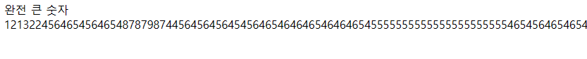


## 문자
> 단일문자나 단일문자가 어려개모인 문자열을 다룰때 사용
> 문자열을 정의할때는 ' '," ",\` \` 등을 이용함

```javascript
   let say1= 'hello!';
   let say2= "hello!";
   let say3= `hello!`;
   
   console.log(say1);
   console.log(say2);
   console.log(say3);
    
```
위의 문자열들을 한번에 합칠때는 아래와 같이 사용한다.
```javascript
   let say1= 'hello!';
   let say2= "hello!";
   let say3= `hello!`;
   
   console.log(say1+say2+say3);
   console.log(say1+say2+say3);
    
```
> 결과 <br>
> 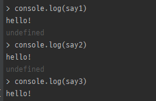<br>

이 중에서 백틱(``)의 경우는 연산자 없이 한번에 작성이 가능하다.
백틱의 경우엔, 선언된 변수를 ${안에 담으면 된다.}
```javascript
   let say1= 'hello';
   let name= "고길동";
   let cha3= `둘리`;
   
   console.log(`${say1}!${name}님! 저는 ${cha3}입니다.`);
```
> 결과<br>
> 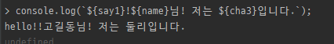

문자는 다음과 같이 배열처럼 지정 위치를 선택할 수 있다
```javascript
   let jumin= '230119-212312';

   (jumin[7] === '2') ? jumin='여성':jumin='남성';
   document.write(`해당주민번호 성별은: ${jumin}`);
   
```
> 결과 <br>
>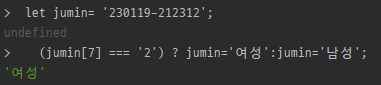 <br>
>

## Boolean
 논리형의 일종으로 true,false 등의 논리값만 존재하며, 주로 긍정, 부정을 나타내는 값에 사용한다.

```javascript
   let isMarried =  false;
   (isMarried) ? 'u r married' : 'u r single';
```
>결과 <br>
>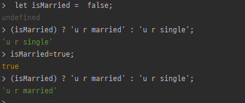

## 객체형(Object)
변수 하나에 여러 종류의 데이터를 담을 수 있다. 
> 예시 ) 이름, 국어, 영어, 수학에 대하여 이름, 총점, 평균 계산 후 출력
```javascript
   let info = {
      name: '둘리',
      math: 90,
      kor: 20,
      eng: 50,
      totlPnt: function(){document.write(`총점: ${this.math+this.kor+this.eng} <br>`)},
      avgs:function(){ return (this.math+this.kor+this.eng)/3 ;}
    }

   document.write(`이름: ${info.name} <br>`);
   info.totlPnt();
   document.write(`평균: ${~~info.avgs()} <br>`);
```
>결과 <br>
>


## 변수의 자료형
### typeof()
```javascript
typeof(10);
typeof('10');
typeof(10n);
typeof(undefined);
typeof(null);
typeof(true);
typeof(function(){});
typeof(nan = {});
```
>결과 <br>
>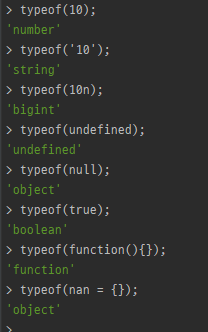

## 자료형 변환
### 묵시적 형번환
함수와 연산자에 전달되는 값은 표현식에 적합하게 적절한 자료형으로변환됨 (묵시적형변환)
```javascript
   let sum = '10'+ 2;
    console.log(typeof (sum)+': '+sum);
```
>결과 <br>
>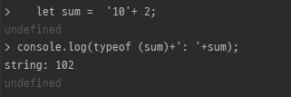

#### 묵시적 형변환 방법 기타예시
> 기타로 사용할 수 있는 재미있는 연산자
> 1. 형변환 연산자
> ```javascript
>   let arr = '12345';
>   //아래 연산은 형변환때문에 문자로 반환함
>   [...arr].reduce((p,n)=>p+n);
> 
>   //아래 연산은 바로 형변환을 진행함
>   [...arr].reduce((p,n)=>+p + +n);
>  
> ```
>결과 <br>
>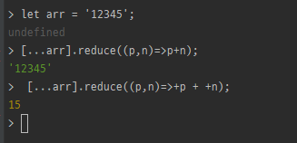
> * 해당 형변환은 javascript 에서만 지원 됨


### 명시적 형변환
상황에따라 의도를 갖고 원하는 자료형으로 직접 변환하는경우도있음(명시적형변환)

```javascript
let strNum = '22';
let num = 22;
let tf = 1;

Number(strNum);
String(num);
Boolean(tf);
```

>결과 <br>
>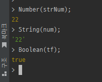


# 자바스크립트 연산자
##  표현식(expression)
리터럴(값),식별자(변수),연산자, 함수 호출등의 조합을 의미.<br>
표현식은 평가 evaluate(표현식이 실행되어 결과값 생성)되어 하나의 값을 만듦
```javascript
    10; //리터럴 표현식
    sum; //식별자 표현식
    10 + 20; //연산자 표현식
    Date(); //함수 표현식
```

### 연산자
하나이상의 표현식을 대상으로 산술,할당,비교,논리,타입 연상을 수행해서 하나의 값을만다는 기호

#### 할당연산자 
오른쪽 피연산자를 왼쪽 피연산자에게 대입하는기호 보통 '='을 의미
```javascript
   let m = 10;
   let n = 3;
   let total = m+n;
```
> 결과
> 

#### 산술 연산자
덧셈,뺄쎔,곱셈,나눗셈 연산을 수행하는 기호.
그외에도 나머지 연산자(%), 증감/감소 연산자(++,--),
거듭제곱(**)등이 있음		
산술 연산자 중 + 는 피연산자 중 하나가 문자열인 경우
문자열을 연결하는 기능을 수행함		
```javascript
   let x = 10;
   let y = 3;
   
   document.write(`10 / 3= ${ x / y}<br>10 % 3= ${ x % y}<br>10 ** 3= ${ x ** y}`)
```

>결과 <br>
>


아래와 같이 문자열+숫자 , boolean, null, undefined같은 계산 가능
```javascript
   document.write(`'1' + 2 = ${ '1' + 2 }<br>`);
   document.write(`1 + true = ${ 1 + true }<br>`);
   document.write(`true + null = ${  true + null }<br>`);
   document.write(`false + null = ${  false + null }<br>`);
   document.write(`true + false = ${  true + false }<br>`);
   document.write(`false + undefined = ${ undefined + false }<br>`);
```
>결과 <br>
>


##### 증감연산자 
증감연산자의 위치에 따라 전치/후치로 나뉨
```javascript
   let x = 10;
   let y = 3;

   document.write(`10 / 3= ${ x / y}<br>10 % 3= ${ x % y}<br>10 ** 3= ${ x ** y}<br>`)
```
>결과 <br>
>

여기서보면 10의 값이 갑자이 10에서 11없이 12로 된다.
자세히 뜯어서 x를 계속 10으로 초기화 하면 언제 증감되는지 확인할 수 있다.

```javascript
   x=10;
   document.write(`10++= ${ x++ }<br>`);
   x=10;
   document.write(`++10= ${ ++x }<br>`);
```

>결과 <br>
>

#### 복합 할당연산자 
할당 연산자와 산술 연산자를 혼합해서 표현식을 간단하게 작성하는데 사용
* syntatic sugar : 프로그래밍 코드를 좀더 sweet 하게 사용할 수 있도록 도와주는 문법

연산자 | 설명
---|---
+= | 덧셈후 대입
-= | 뺄셈후 대입
*= | 곱셈후 대입
/= | 나눗셈후 대입

```javascript
   let i = 5;
   i += 10 ;
   
   let j = 3; 
   j*=5;

   (i===j);
```
>결과 <br>
>

```javascript
   let output = 'hello!';
    output += 'goodbye!'
```
>결과 <br>
>

#### 비교연산자
두 항의 값을 비교하여 참인지 거짓인지 반환해주는 연산자

연산자 | 설명
---|---
A>B | A가 B보다 크면 참 반환
A>=B | A가 B보다 크거나 같으면 참 반환
A<B | A가 B보다 작으면 참 반환
A<=B | A가 B보다 작거나 같으면 참 반환
A==B | A와 B가 같으면 참 반환
A===B | A와 B가 값, 자료형이 같으면 참 반환

>javascript에서 == 연산자로 비교시 변수들의 자료형을 일치시키는 암묵적 형변환이 발생함<br>
> 비교연산자(==)는 경우에따라 많은 부작용이 양산되므로 ===를 사용할 것!

```javascript 
(10>5)?'참입니다':'거짓입니다';
(10=='10')?'참입니다':'거짓입니다';
(10==='10')?'참입니다':'거짓입니다';

```
>결과 <br>
>

#### 삼항연산자 
>조건문 if~else의 sytantic sugar <br> 
>(조건식 참 )? 참결과: 거짓결과;

```javascript
let jumsu = 65;
(jumsu>=60)? '합격':'불합격';
```
>결과 <br>
>

#### 논리연산자
boolean표현식에 대한 논리합(||) 또는 논리곱(&&) 또는 부정 연산자(!)를 수행하는 기호

연산자 | 설명                     
---|------------------------
A && B | A조건과 B조건을 모두 충족할때 true 반환(앞 조건식에서 false가 나오면 바로 false 반환)
A & B | A조건과 B조건을 모두 충족할때 true 반환(앞 조건식이 false여도 뒤의 조건식이 true인지 false인지 판단을 함 )
A ll B | A조건과 B조건중 하나라도 true일때 true 반환 
A ll B ll C | A조건과 B조건중에 첫번째 true일때 ture 반환 

> short circuit evaluate : 단축식 평가라고도 함 
```javascript
true || false;
true && false; 
true || false || true;
```
>결과 <br>
>

```javascript
// OR일때
undefined || 1
null || 1
// AND일때
undefined && 1
null && 1

// AND구분 
null &  1 &  undefined;
null &&  1 &&  undefined;
```
>결과 <br>
>

# 자바스크립트 제어문
## 조건문
* 특정 조건에 대한 만족여부에따라 실행할코드를 결정하는기능
* 크게 if와 switch 문이 있음
```javascript
   if(Boolean 표현식){
        실행
   }
   
   switch(값){
      case 값 : 실행;
      break;
      defualt : 기본실행값;
   }

```

### 코드블록
* 0개 이상의 명령문을 중괄호로 묶은것.
* 블록은 단독으로 사용가능하나 일반적으로 제어문, 함수사용 시 사용
```javascript
   {
      console.log(`<b>hello, code block!</b>`);
   }  //코드블록, 블록
```

### if 
* 조건을 만족할때만 지정한 코드블록을 실행한다.
```javascript
   //점수가 60점 이상이면 합격을 출력
    let jumsu = 60;
    if(jumsu >= 60){
        console.log('합격');
    }
```
>결과 <br>
>


### else 
* 조건을 만족하면 if아래의 코드블록을 실행하고, 만족하지 않을경우 else 아래의 코드블록을 실행한다.
```javascript
   if(조건식){
       참일때 실행
   }else{
       거짓일때 실행
   }
```

```javascript
   //점수가 60점 이상이면 합격을 출력
    let jumsu = 60;
    if(jumsu >= 60){
        console.log('합격');
    }else{
        console.log('불합격');
    }
```
>결과 <br>
>


