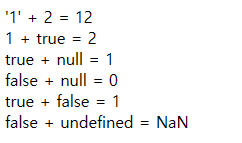
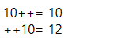

# javascript
1. [자바스크립트 사용방법](#자바스크립트-사용법)
   1. [인라인](#인라인)
   2. [내부](#내부)
   3. [외부](#외부)

2. [자바스크립트 자료형](#자바스크립트-자료형)
   1. [변수](#변수--variable-)
   2. [상수](#상수--constant-)
   3. [숫자형](#숫자) 
   4. [문자형](#문자)
   5. [참/거짓](#Boolean)
   6. [객체형](#객체형--object-)
   7. [자료형 파악하기](#변수의-자료형)
   8. [자료형 변환하기](#자료형-변환)

3. [자바스크립트 연산자](#자바스크립트-연산자)
   1. [할당연산자](#할당연산자)
   2. [산술연산자](#산술-연산자)
   3. [복합 할당연산자](#복합-할당연산자)
   4. [비교연산자](#비교연산자)
   5. [삼항연산자](#삼항연산자)
   6. [논리연산자](#논리연산자)

4. [자바스크립트 제어문](#자바스크립트-제어문)
   1. [조건문](#조건문)
      1. [if](#if)
      2. [if~else](#else)
   2.


# 자바스크립트 연산자
##  표현식(expression)
리터럴(값),식별자(변수),연산자, 함수 호출등의 조합을 의미.<br>
표현식은 평가 evaluate(표현식이 실행되어 결과값 생성)되어 하나의 값을 만듦
```javascript
    10; //리터럴 표현식
    sum; //식별자 표현식
    10 + 20; //연산자 표현식
    Date(); //함수 표현식
```

### 연산자
하나이상의 표현식을 대상으로 산술,할당,비교,논리,타입 연상을 수행해서 하나의 값을만다는 기호

#### 할당연산자 
오른쪽 피연산자를 왼쪽 피연산자에게 대입하는기호 보통 '='을 의미
```javascript
   let m = 10;
   let n = 3;
   let total = m+n;
```
> 결과
> 

#### 산술 연산자
덧셈,뺄쎔,곱셈,나눗셈 연산을 수행하는 기호.
그외에도 나머지 연산자(%), 증감/감소 연산자(++,--),
거듭제곱(**)등이 있음		
산술 연산자 중 + 는 피연산자 중 하나가 문자열인 경우
문자열을 연결하는 기능을 수행함		
```javascript
   let x = 10;
   let y = 3;
   
   document.write(`10 / 3= ${ x / y}<br>10 % 3= ${ x % y}<br>10 ** 3= ${ x ** y}`)
```

>결과 <br>
>


아래와 같이 문자열+숫자 , boolean, null, undefined같은 계산 가능
```javascript
   document.write(`'1' + 2 = ${ '1' + 2 }<br>`);
   document.write(`1 + true = ${ 1 + true }<br>`);
   document.write(`true + null = ${  true + null }<br>`);
   document.write(`false + null = ${  false + null }<br>`);
   document.write(`true + false = ${  true + false }<br>`);
   document.write(`false + undefined = ${ undefined + false }<br>`);
```
>결과 <br>
>


##### 증감연산자 
증감연산자의 위치에 따라 전치/후치로 나뉨
```javascript
   let x = 10;
   let y = 3;

   document.write(`10 / 3= ${ x / y}<br>10 % 3= ${ x % y}<br>10 ** 3= ${ x ** y}<br>`)
```
>결과 <br>
>

여기서보면 10의 값이 갑자이 10에서 11없이 12로 된다.
자세히 뜯어서 x를 계속 10으로 초기화 하면 언제 증감되는지 확인할 수 있다.

```javascript
   x=10;
   document.write(`10++= ${ x++ }<br>`);
   x=10;
   document.write(`++10= ${ ++x }<br>`);
```

>결과 <br>
>

#### 복합 할당연산자 
할당 연산자와 산술 연산자를 혼합해서 표현식을 간단하게 작성하는데 사용
* syntatic sugar : 프로그래밍 코드를 좀더 sweet 하게 사용할 수 있도록 도와주는 문법

연산자 | 설명
---|---
+= | 덧셈후 대입
-= | 뺄셈후 대입
*= | 곱셈후 대입
/= | 나눗셈후 대입

```javascript
   let i = 5;
   i += 10 ;
   
   let j = 3; 
   j*=5;

   (i===j);
```
>결과 <br>
>

```javascript
   let output = 'hello!';
    output += 'goodbye!'
```
>결과 <br>
>

#### 비교연산자
두 항의 값을 비교하여 참인지 거짓인지 반환해주는 연산자

연산자 | 설명
---|---
A>B | A가 B보다 크면 참 반환
A>=B | A가 B보다 크거나 같으면 참 반환
A<B | A가 B보다 작으면 참 반환
A<=B | A가 B보다 작거나 같으면 참 반환
A==B | A와 B가 같으면 참 반환
A===B | A와 B가 값, 자료형이 같으면 참 반환

>javascript에서 == 연산자로 비교시 변수들의 자료형을 일치시키는 암묵적 형변환이 발생함<br>
> 비교연산자(==)는 경우에따라 많은 부작용이 양산되므로 ===를 사용할 것!

```javascript 
(10>5)?'참입니다':'거짓입니다';
(10=='10')?'참입니다':'거짓입니다';
(10==='10')?'참입니다':'거짓입니다';

```
>결과 <br>
>

#### 삼항연산자 
>조건문 if~else의 sytantic sugar <br> 
>(조건식 참 )? 참결과: 거짓결과;

```javascript
let jumsu = 65;
(jumsu>=60)? '합격':'불합격';
```
>결과 <br>
>

#### 논리연산자
boolean표현식에 대한 논리합(||) 또는 논리곱(&&) 또는 부정 연산자(!)를 수행하는 기호

연산자 | 설명                     
---|------------------------
A && B | A조건과 B조건을 모두 충족할때 true 반환(앞 조건식에서 false가 나오면 바로 false 반환)
A & B | A조건과 B조건을 모두 충족할때 true 반환(앞 조건식이 false여도 뒤의 조건식이 true인지 false인지 판단을 함 )
A ll B | A조건과 B조건중 하나라도 true일때 true 반환 
A ll B ll C | A조건과 B조건중에 첫번째 true일때 ture 반환 

> short circuit evaluate : 단축식 평가라고도 함 
```javascript
true || false;
true && false; 
true || false || true;
```
>결과 <br>
>

```javascript
// OR일때
undefined || 1
null || 1
// AND일때
undefined && 1
null && 1

// AND구분 
null &  1 &  undefined;
null &&  1 &&  undefined;
```
>결과 <br>
>

# 자바스크립트 제어문
## 조건문
* 특정 조건에 대한 만족여부에따라 실행할코드를 결정하는기능
* 크게 if와 switch 문이 있음
```javascript
   if(Boolean 표현식){
        실행
   }
   
   switch(값){
      case 값 : 실행;
      break;
      defualt : 기본실행값;
   }

```

### 코드블록
* 0개 이상의 명령문을 중괄호로 묶은것.
* 블록은 단독으로 사용가능하나 일반적으로 제어문, 함수사용 시 사용
```javascript
   {
      console.log(`<b>hello, code block!</b>`);
   }  //코드블록, 블록
```

### if 
* 조건을 만족할때만 지정한 코드블록을 실행한다.
```javascript
   //점수가 60점 이상이면 합격을 출력
    let jumsu = 60;
    if(jumsu >= 60){
        console.log('합격');
    }
```
>결과 <br>
>


### else 
* 조건을 만족하면 if아래의 코드블록을 실행하고, 만족하지 않을경우 else 아래의 코드블록을 실행한다.
```javascript
   if(조건식){
       참일때 실행
   }else{
       거짓일때 실행
   }
```

```javascript
   //점수가 60점 이상이면 합격을 출력
    let jumsu = 60;
    if(jumsu >= 60){
        console.log('합격');
    }else{
        console.log('불합격');
    }
```
>결과 <br>
>


### 조건식의 조건
* false, 0 , undifined, null, NaN, 빈문자열등은 조건식에서 거짓으로 취급한다.
```javascript
let bTest = true;
    bTest = null;
   if(!bTest){
       console.log('거짓입니다.');
   }
```
>결과 <br>
>


## 중첩조건문
* if나 else안에 또다른 if나 else를 추가하는것
* 단점: 가독성이 떨어지므로 코드의 사용 자제
```javascript
    // 특정년도의 윤년여부를 출력 v2
    // 조건1 : 4로 나누어 떨어짐
    // 조건2 : 4로 나누어 떨어지고 100으로도 나눠 떨어지면 평년
    // 조건3 : 400으로 나눠떨어지면 윤년
   
    year = parseInt(prompt('년도를 입력해주세요'));
    let result2 = `${year}- 평년입니다.`;
    if(year % 4 === 0){
        if( year % 100 !=0){
        result2=`${year} - 윤년입니다.`;
        }else{
        result2=`${year} - 평년입니다.`;
        }
    }else{
        if(year % 400 ===0){
            result2=`${year} - 윤년입니다.`;
        }else{
            result2=`${year} - 평년입니다.`;
        }
    }
   
    document.write(result2);
```
>결과 <br>
>

## 다중조건문
* 다중조건에 대한 만족여부에 따라 if ~ else if ~ else 형식으로 사용.
```javascript
// 평균점수에 따라서 수우미양가 결과를 출력하는 학점 계산기
    let avg = prompt('학점을 입력해주세요!');
    let sco = '';

    if(avg>=90 && avg <= 100 ) {sco='수'}
        else if(avg >= 80){sco='우'}
        else if(avg >= 70 ){sco='미'}
        else if(avg >= 60 ){sco='양'}
        else if( avg >= 0) {sco='가'}
        else{ sco='학점 산출 불가! 각 과목별 점수는 100점이하 및 숫자로만 입력해주세요!';}

    document.write(sco);
```
>결과 <br>
>
